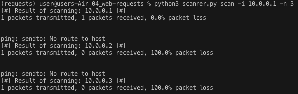

# Начинаем писать сканнер

- [The Main File](scanner.py)
- [Lib](./app/lib.py)
- [Server](./app/server.py)
- [Dockerfile](Dockerfile)
- [requirements](./requirements.txt)

## Ожидаемый функционал

**DONE**

- поиск хостов с ping sweep
- отправка http запросов

### Пример http запроса:

```bash
python3 scanner.py sendhttp -t https://google.com -m GET -hd Accept-Language:ru
```

То же самое из докера:
```bash
docker run --rm -it scanner sendhttp -t https://google.com -m GET -hd Accept-Language:ru
```

- `scanner.py` — название файла с кодом утилиты;
- `sendhttp` — название задачи, которую требуется решить
  - (в данном случае это отправка HTTP-запросов,
  - также есть задание scan, которое осуществляет сканирование сети);
- `-t` — аргумент, который указывается для задания цели для отправки HTTP-запроса;
- `-m` — аргумент, который указывается для задания типа запроса (POST или GET);
- `-hd` — аргумент, который указывается для задания заголовков.

### Пример поиска хостов

```bash
./scanner.py scan -i 10.0.0.1 -n 3
```

То же самое из докера:
```bash
docker run --rm -it scanner scan -i 10.0.0.1 -n 3
```



## Дополнительное задание

ПРИМЕР РАБОТЫ УТИЛИТЫ ЧЕРЕЗ API

Запуск сервера БЕЗ докера:
```bash
./scanner.py server
```

Сборка контейнера:
```bash
docker build -f scanner .
```

Запуск сервера ИЗ докера:
```bash
docker run --rm -it -p 127.0.0.1:3000:3000 scanner server
```
или
```bash
docker run --rm -d --name scanner -p 127.0.0.1:3000:3000 scanner server
# но так не столь удобно смотреть как сервер реагирует на реквесты
```

- Адрес докер-контейнера: 192.168.1.10
- Порт, на котором работает API: 3000

1. Пользователь может отправить POST-запрос на `192.168.1.10:3000/sendhttp` со следующим телом запроса:

```json
{"Header": "Content-type", "Header-value": "text", "Target":"www.google.com", "Method": "GET"}
```

Пример работающего curl запроса с соответствующим телом:

```bash
curl -X POST -H "Content-Type: application/json" -d '{"Header": "Content-type", "Header-value": "text", "Target":"www.google.com", "Method": "GET"}' http://localhost:3000/sendhttp
```

Утилита в докере получает этот запрос и отправляет на адрес www.google.com GET-запрос, в котором есть header "Content-type" со значением "text". При получении ответа утилита отправляет пользователю HTTP-ответ с результатами.

2. Пользователь может отправить GET-запрос на `192.168.1.10:3000/scan` со следующим телом запроса:

```json
{"target":"192.168.1.0", "count": "20"}
```

Пример работающего curl запроса с соответствующим телом:

```bash
curl -X GET -H "Content-Type: application/json" -d '{"target":"192.168.1.0", "count": "20"}' http://localhost:3000/scan
```

192.168.1.0 в данном случае — сеть, которую нужно просканировать, а 20 — количество устройств, которые нужно просканировать. В итоге будут просканированы IP-адреса 192.168.1.1 – 192.168.1.20.

API получает этот запрос и сканирует сеть с заданными параметрами, а результат сканирования отправляет в качестве HTTP-ответа.

## Сделано сверх этого

- отдебажен заданный ping sweep --- команда не работала на MacOS и Linux, теперь работает. Понадобилось определять, на какой ОС скрипт запущен
- логирование [хэдэра](headers.json), [респонса](response.html) и [статуса](status.txt) последнего выполненного http запроса
- успешно проверил на винде, маке и линуксе
